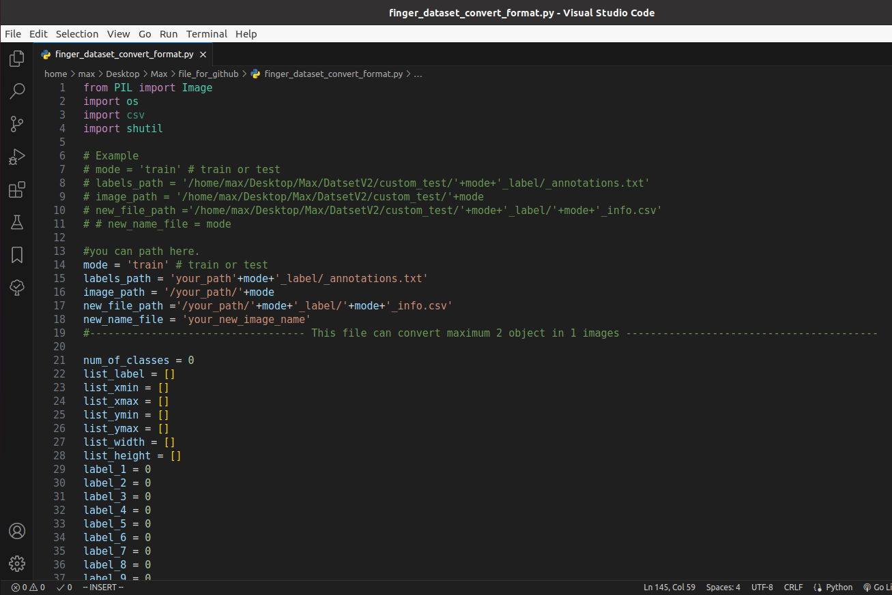

# MAX78000_prepare_dataset.
Prepare dataset before train AI with MAX78000 object detection ssd by use ai85net-tinierssd model
## Prepare dataset.

If you don't have `data` folder create it.

In this case, the preparation of the Dataset Finger Number is given as an example.
You can labeling images by roboflow and export dataset YOLO v4 PyTorch.

After exporting, place that file in your directory.

Open that file and move `test` and `train` folder from into your directory . 

Inside  `test` folder.

In `_class.txt` .

In `_annotation.txt` .

### A step) You can use `finger_dataset_convert_format.py` to get renamed images and csv file(all parameter must be use to train an AI).

Download [finger_dataset_convert_format.py](https://github.com/WeerawatW/MAX78000-prepare-dataset/blob/main/github%20python%20file/finger_dataset_convert_format.py) here,
 This script use for 1)convert .txt  to .csv format 2)rename images files. 

Note: Change ***mode*** to `test`and change ***path*** to extracted directory, `finger_dataset_convert_format.py` file can convert limit only 2 object in 1 image, if you want to add object more than 2 you can modify `finger_dataset_convert_format.py` code.

### Ship label.
For example we have 6 class `finger_number.py` output(1,2,3,4,5,6) but we have labels (0,1,2,3,4,5),
we would ship label +1 of any class because label must also match the output of `finger_number.py` .
> After ship label we have label (1,2,3,4,5,6).... ok this labels match `finger_number.py` output(1,2,3,4,5,6).

Then , Run `finger_dataset_convert_format.py` .

Result.
After run `finger_dataset_convert_format.py` that program generate `test_rename` folder and `test_info.csv` file.

test_rename (images)

test_info.csv. (annotations)

### Repeat A step) to get `train_info.csv` too, we must be use for training AI step.
* changes ***mode** `test` to `train`.

You will got an same result is renamed images and get `train_info.csv` .

Open `train_info.csv` and `test_info.csv` with Text Editor.

In `train_info.csv` and `test_info.csv` .

### 5) Delete `'` by this step.

Click `Replace All`

Save file and repeat step 5) for `train_info.csv`

than delete these file `test` and `train`, rename `test_rename` folder -> `test` and `train_rename` folder -> `train` folder.

Create `processed` folder

Move `train_info.csv` and `test_info.csv` to `processed` folder .

### Congratulation!! , now you have  `processed`, `test`, `train` folder.
Follow the next steps to train AI and generate c code : https://github.com/WeerawatW/MAX78000-hand_gesture_control#1-ai8x-training
