# MAX78000_prepare_dataset.
Prepare dataset before train AI with MAX78000 object detection ssd by use ai85net-tinierssd model
## Prepare dataset.
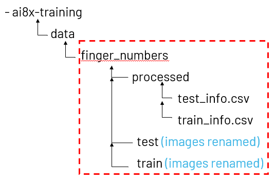

In this case, the preparation of the Dataset Finger Number is given as an example.
### You can labeling images by roboflow and export dataset YOLO v4 PyTorch.
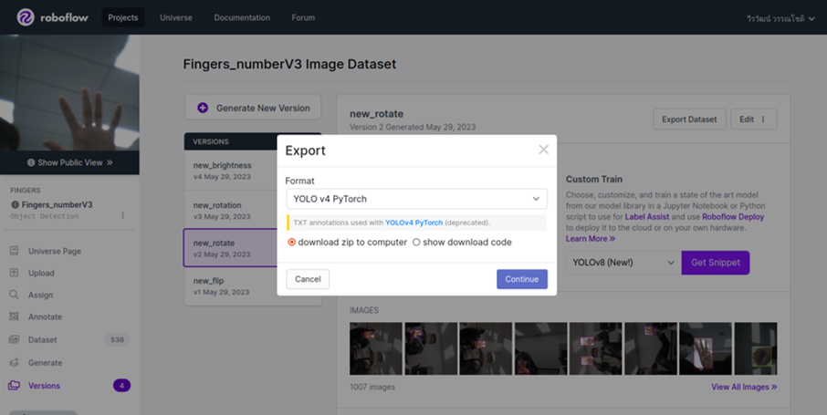

### After exporting, place that file in your directory.

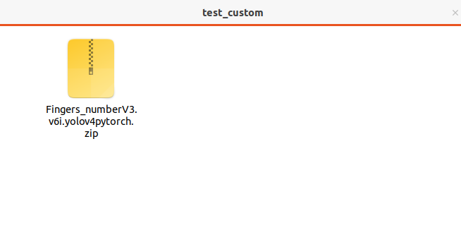

### Extract file .

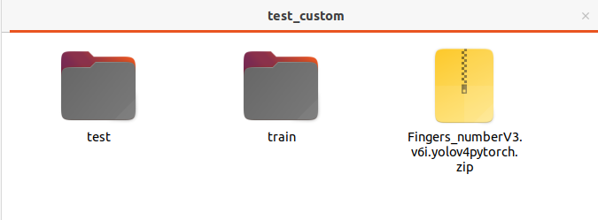

### In folder `test` .

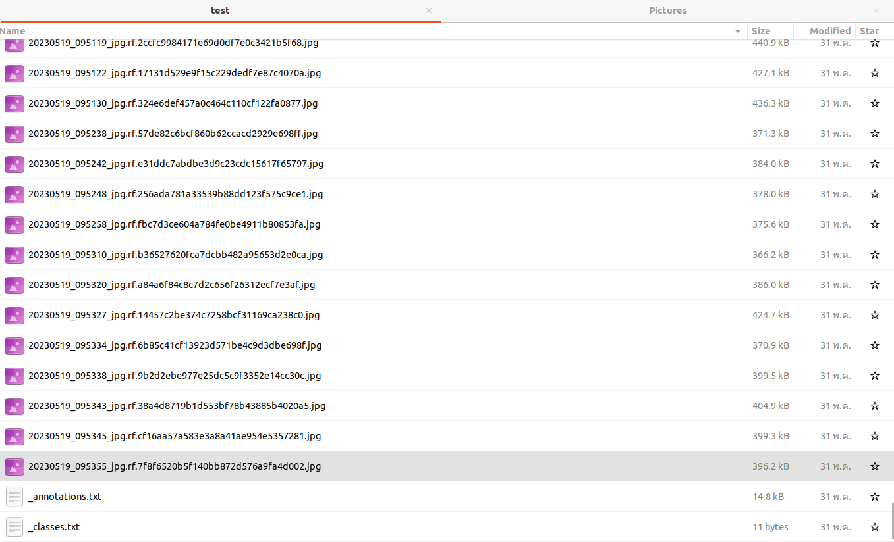

### 1) Create `test_label` folder.

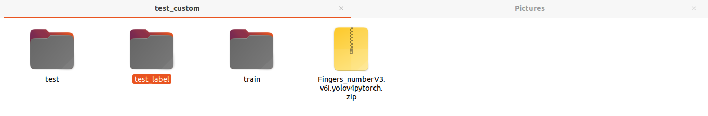

Why we create test_label ? , because we want to keep the image folder and the .txt format folder separate.

### 2) Select `_annotation.txt` and `_class.txt` .

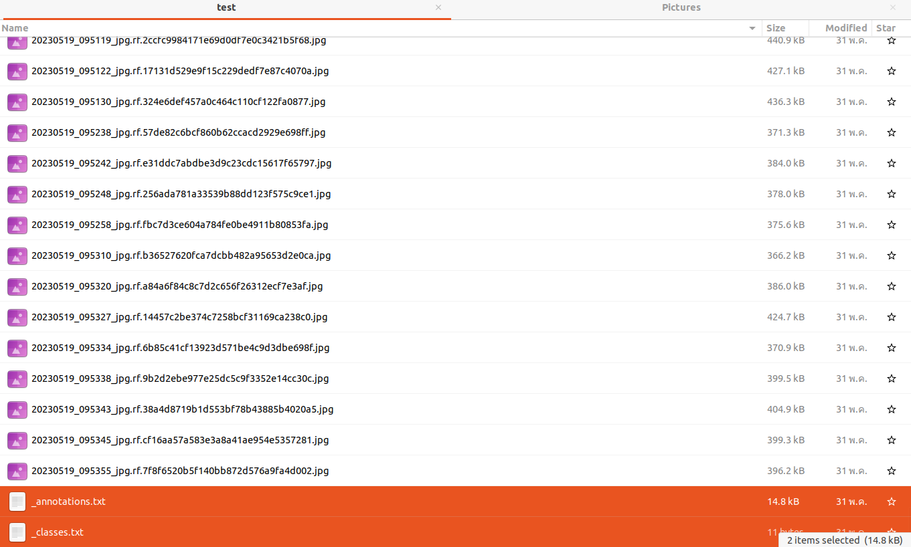

### 3) Cut `_annotation.txt` and `_class.txt` file to `test_label` folder.

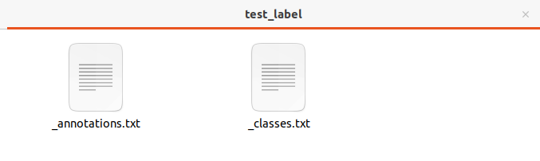

### In `_class.txt` .

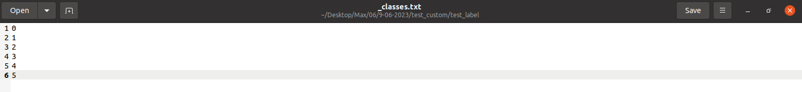

### In `_annotation.txt` .
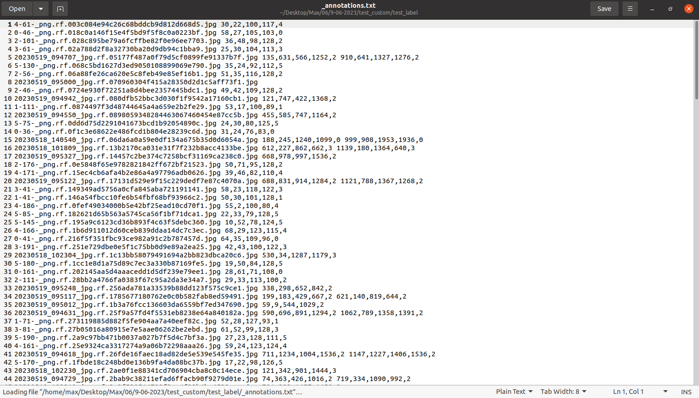

### 4) You can use `finger_dataset_convert_format.py` to get renamed images and csv file(all parameter must be use to train an AI).
download `finger_dataset_convert_format.py here: https://github.com/WeerawatW/MAX78000_custom_dataset/blob/cf44a8066d831074396bc79ce04c0f4347fa6c13/github%20python%20file/finger_dataset_convert_format.py

Change your paths for images, text, and csv files, and changes any file names.

Note: that file can convert limit only 2 object in 1 image, if you want to add object more than 2 you can modify `finger_dataset_convert_format.py` code.

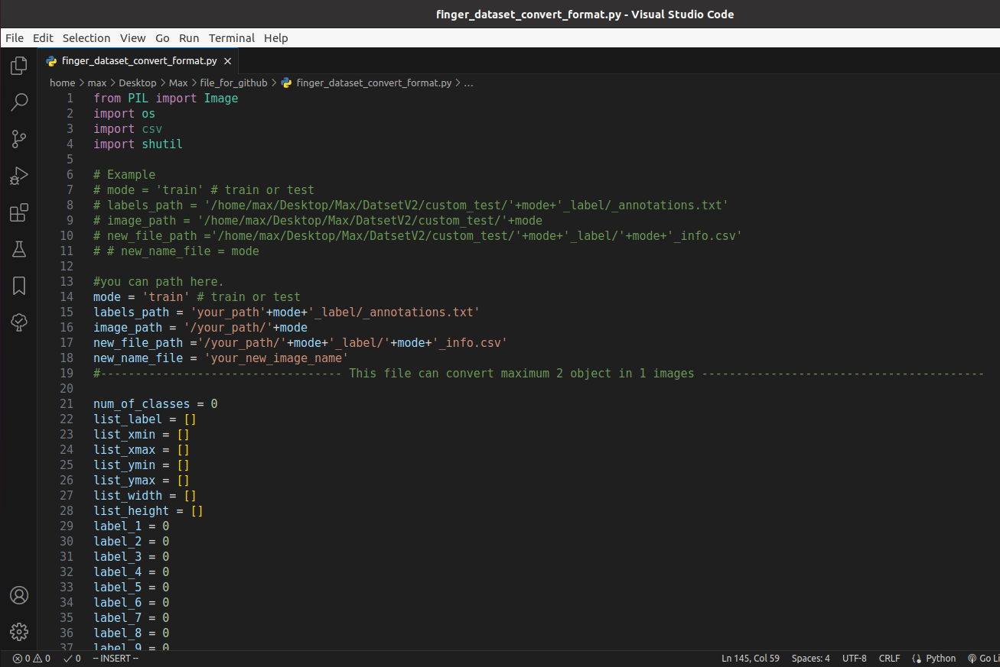

However, in our project, I would ship label +1 of any class because label must also match the output of `finger_number.py` .
### Ship label.

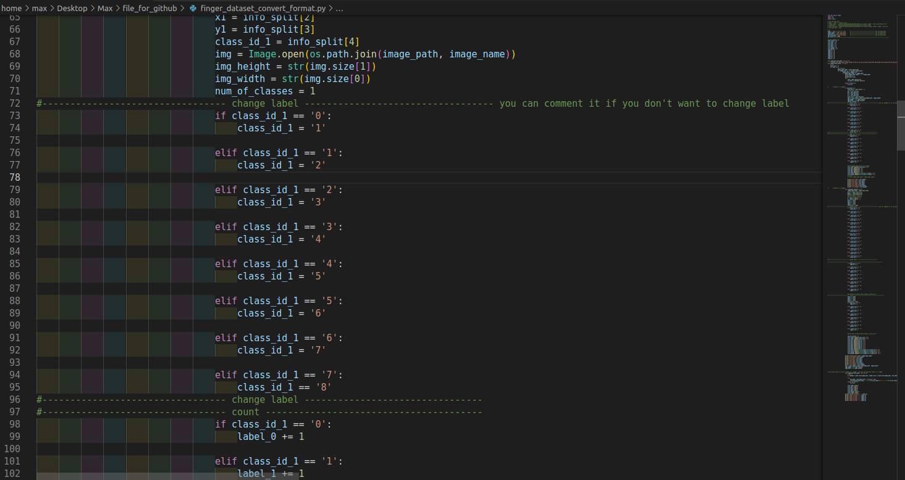

Then , Run `finger_dataset_convert_format.py` .

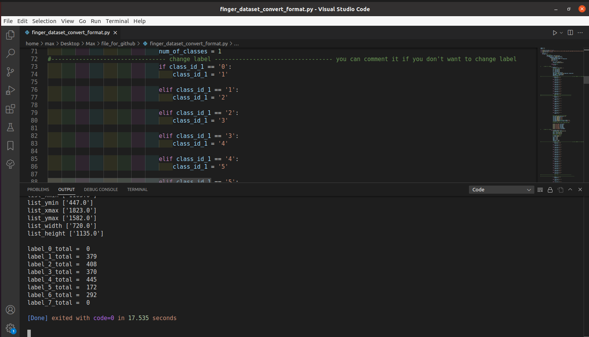

### Result.
After run `finger_dataset_convert_format.py` that program generate `test_rename` folder and `test_info.csv` file.

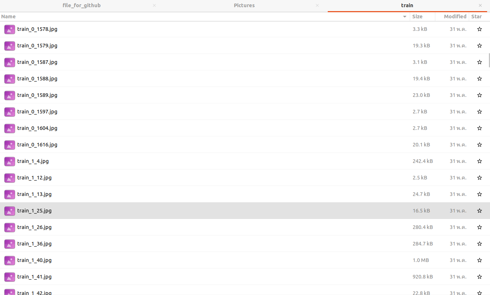

You'll get `test_info.csv` .

### Repeat steps 1 through 4 to get `train_info.csv` too, we must be use for training AI step.
step 1) Create `train_label` folder .

step 2) Select `_annotation.txt` and `_class.txt` .

step 3) Move to `test_label` folder .

step 4) Change your paths for images, text, and csv files, and changes any file names from `test` to `train` path.

You will got an same result is renamed images and get `train_info.csv` .

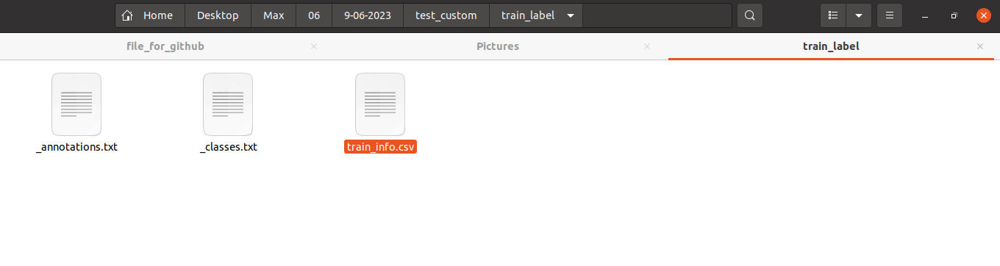

### Open `train_info.csv` and `test_info.csv` with Text Editor.

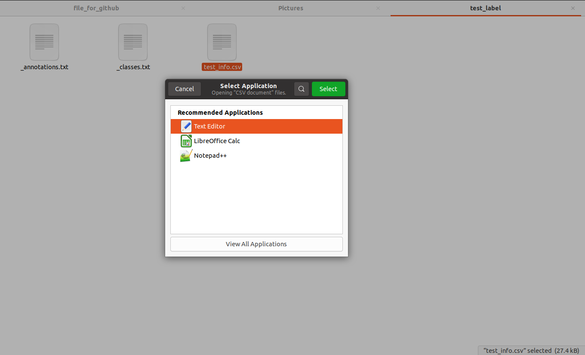

### In `train_info.csv` and `test_info.csv` .

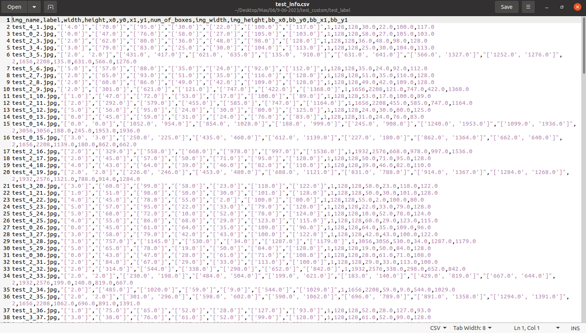

### 5) Delete `'` by this step.

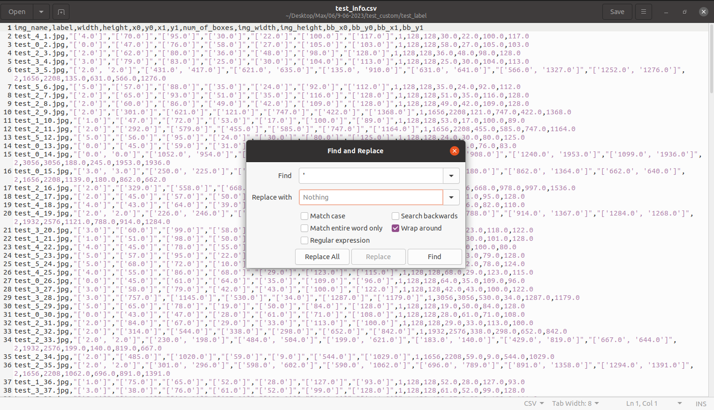

Click `Replace All`

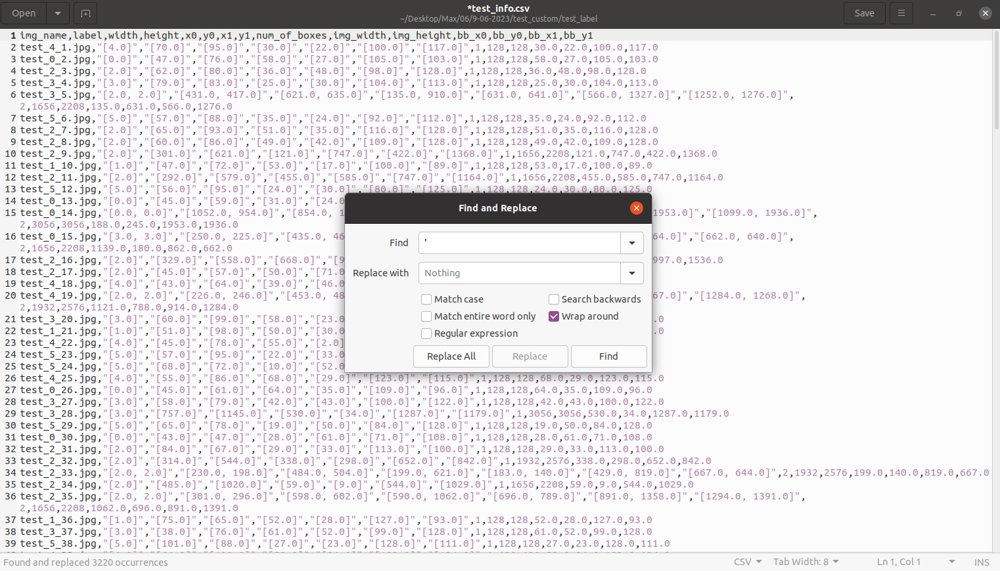

Save file and repeat step 5) for `train_info.csv`

### Create `processed` folder

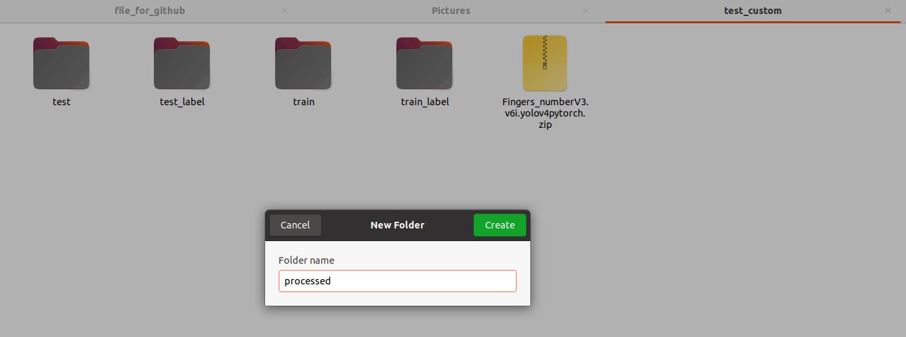

### Move `train_info.csv` and `test_info.csv` to `processed` folder .
than delete these file `test` and `train`, rename `test_rename` folder -> `test` and `train_rename` folder -> `train` folder.

### Congratulation!! , now you have  `processed`, `test`, `train` folder.
Follow the next steps to train AI and generate c code : https://github.com/WeerawatW/MAX78000-hand_gesture_control#1-ai8x-training
