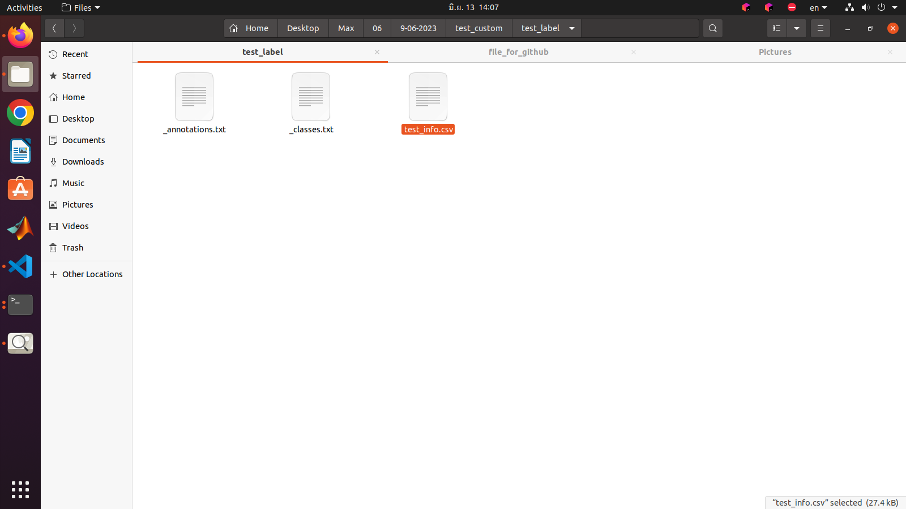

# MAX78000_prepare_dataset
Prepare dataset before train AI with MAX78000 object detection ssd by use ai85net-tinierssd model
## Prepare dataset

In this case, the preparation of the Dataset Finger Number is given as an example.
### You can labeling images by roboflow and export dataset YOLO v4 PyTorch.

### After exporting, place that file in your directory.

### Extract file .

### In folder `test`

### Create `test_label` folder

### Select `_annotation.txt` and `_class.txt`

### Move to `test_label` folder

### In `_class.txt`

### In `_annotation.txt`

### You can use `finger_dataset_convert_format.py` to get renamed images and csv file(all parameter must be use to train an AI)
download `finger_dataset_convert_format.py here: https://github.com/WeerawatW/MAX78000_custom_dataset/blob/cf44a8066d831074396bc79ce04c0f4347fa6c13/github%20python%20file/finger_dataset_convert_format.py
Change your paths for images, text, and csv files, and changes any file names.

However, in our project, I would ship label +1 of any class because label must also match the output of `finger_number.py`.
### Ship label

### `finger_number.py` output
how to place `finger_number.py` see here: https://github.com/WeerawatW/MAX78000-hand_gesture_control#1-ai8x-training

Then , Run `finger_dataset_convert_format.py`.

### Result
Renamed images.

You'll get `test_info.csv`.

### Repeat with these steps to get `train_info.csv` too, we must be use for training step.

